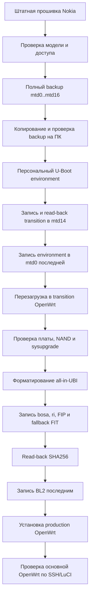
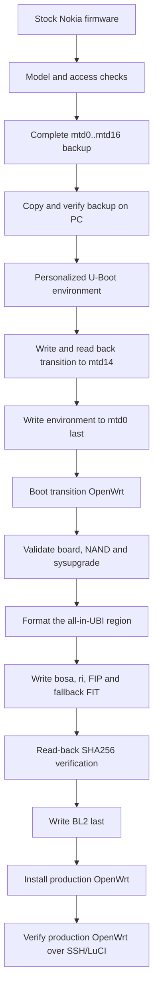

<div align="center">

# 🐻 Nokia Router MedveFlasher

**Установка OpenWrt на Nokia XG-040G-MD без UART**  
**Install OpenWrt on the Nokia XG-040G-MD without UART**


[Русский](#-русский) · [English](#-english)

</div>

> [!CAUTION]
> **Release Candidate. Прошивка NAND всегда связана с риском получить нерабочее устройство.**  
> До начала работ сохраните полный проверенный backup на компьютере, отключите оптический кабель и обеспечьте стабильное питание. Не отключайте питание во время записи. Для восстановления полностью не загружающегося устройства нужен USB-UART 3,3 В.

---

# 🇷🇺 Русский

## Что это

**Nokia Router MedveFlasher** — двуязычный Python-мастер для Nokia / Nokia Shanghai Bell **XG-040G-MD** на Airoha **AN7581**. Он выполняет полный цикл обслуживания по Ethernet:

- снимает полный проверенный backup штатной NAND;
- устанавливает OpenWrt + LuCI в схему **all-in-UBI** без UART;
- умеет устанавливать выбранный пользователем UBI sysupgrade через отдельный ручной transition;
- возвращает штатную прошивку из работающей OpenWrt без UART;
- восстанавливает полностью не загружающееся устройство через BootROM и USB-UART;
- сохраняет подробный журнал каждой операции.

Python-зависимостей нет: используется только стандартная библиотека. На Windows дополнительно нужен системный OpenSSH-клиент для связи с переходной OpenWrt.

## Текущий статус

| Сценарий | Статус |
|---|---|
| Штатная прошивка → стандартный transition → комплектная OpenWrt | **Проверено на устройстве** |
| Работающая OpenWrt → временная recovery в RAM → штатная прошивка | **Проверено на устройстве** |
| BootROM → XMODEM → U-Boot в RAM → восстановление стока | **Проверено на устройстве** |
| Отдельный manual transition → собственный sysupgrade | Статические и синтетические проверки пройдены; полный аппаратный цикл ещё требует подтверждения |
| Автоматическое отклонение XG-040G-MF / AN7583 | Реализовано; аппаратная проверка на MF желательна |

## Что умеет

| Возможность | Описание |
|---|---|
| 📦 **Полный backup** | Снимает `mtd0..mtd16`, сохраняет отдельные разделы и полный `all_flash`, проверяет размеры, gzip и SHA256, затем копирует backup на ПК |
| 🔄 **Обычная установка** | Записывает переходный образ, загружает временную OpenWrt, форматирует NAND в all-in-UBI и устанавливает комплектный sysupgrade |
| 🧪 **Свой sysupgrade** | Загружает отдельный manual transition без автопрошивки, принимает `.itb` с диска ПК, проверяет его и только затем запускает запись |
| ⏮️ **Откат на сток** | Из работающей OpenWrt временно загружает recovery в RAM, восстанавливает NAND из полного backup и проверяет запись чтением |
| 🧱 **Восстановление кирпича** | BootROM `C` → XMODEM preloader → U-Boot в RAM → TFTP recovery → восстановление полного stock NAND |
| 🌐 **Транспорты** | USB/Samba, USB/FTP или прямой TFTP; копирование показывает проценты, объём, скорость, число файлов и текущий файл |
| 🔐 **Защита** | Проверка модели, точной MTD-разметки и геометрии NAND, read-back SHA256, BL2 записывается последним |
| 📝 **Диагностика** | Цветная операторская консоль, отдельные стадии установки, изменения портов и полный сырой журнал для разбора ошибок |

## Поддерживаемое устройство

Комплект предназначен **только для Nokia XG-040G-MD с Airoha AN7581** и поддерживаемой штатной таблицей NAND.

Близкая модель **Nokia XG-040G-MF / AN7583 не поддерживается**. У неё может совпадать разметка, поэтому одной проверки MTD недостаточно. Автоматический режим определяет устройство через штатный Web UI и блокирует AN/EN7583.

### NAND

Основной подтверждённый вариант — **SkyHigh ML02G300WHI00**.

- явно обнаруженная **FudanMicro FM25G02B блокируется**;
- неопознанная NAND допускается только после точной проверки платы, MTD и геометрии и отдельного подтверждения оператора;
- экспертный режим намеренно пропускает проверку модели роутера, поэтому ответственность за совместимость полностью лежит на операторе.

## Критические ограничения

- Установка не является атомарной: потеря питания во время записи может привести к кирпичу.
- Полный backup должен быть сохранён **на ПК**, а не только на USB-флешке в роутере.
- Backup содержит уникальные данные устройства: MAC-адреса, серийные номера, ONU/GPON-параметры, калибровку, учётные данные и настройки провайдера. **Не публикуйте его.**
- Не используйте пакет на других моделях Nokia, даже если названия разделов похожи.
- Проект не заявляет поддержку оптического интерфейса в OpenWrt; состояние сетевых функций конкретного образа смотрите в [docs/IMAGE_STATUS_RU.md](docs/IMAGE_STATUS_RU.md).
- Для обычной установки и отката UART не нужен, но для восстановления полного кирпича он обязателен.

## Принципы безопасности

MedveFlasher сохраняет следующие инварианты:

1. **Fail closed.** Неоднозначная или ошибочная проверка останавливает обычный сценарий.
2. **Модель проверяется до первой записи.** Автоматический путь подтверждает AN7581 через Web UI.
3. **Полный backup обязателен.** Установка не продолжается, пока backup не создан и не проверен.
4. **Персональный environment.** U-Boot environment формируется из `mtd0` конкретного устройства и привязывается к SHA256 исходного bootloader.
5. **Read-back verification.** Критичные записи читаются обратно и проверяются SHA256.
6. **BL2 записывается последним.** Сначала создаётся и проверяется UBI-среда, затем записывается полный раздел BL2.
7. **Секреты не журналируются.** Пароли хранятся только в памяти процесса и фильтруются из session log.
8. **Сырой вывод сохраняется отдельно.** Пользователь видит краткие события, а полный transition/SSH transcript остаётся в журнале.

## Как проходит обычная установка



### Точки невозврата

До ввода фразы:

```text
CONFIRM FORMAT AND FLASH
```

мастер выполняет только проверки, backup и подготовку. После подтверждения начинается запись переходного образа. Во втором этапе transition самостоятельно проверяет payload, форматирует UBI и устанавливает OpenWrt.

## Экспертная установка собственного sysupgrade

В меню доступа выберите:

```text
4 — Установить свой образ OpenWrt (экспертный режим)
```

Этот путь отличается от стандартного:

1. проверка модели роутера пропускается;
2. используется только прямой TFTP;
3. записывается отдельный `transition-manual-bundle.bin` размером 8 МиБ;
4. manual transition не содержит production sysupgrade и не запускает второй этап автоматически;
5. после загрузки SSH мастер предлагает выбрать `.itb` на диске ПК;
6. выполняются FIT magic/размер, локальный SHA256, удалённый SHA256, `nokia-ubi-installer check` и `sysupgrade -T`;
7. `sysupgrade -F` не используется;
8. форматирование начинается только после второго подтверждения `да/нет`.

> [!WARNING]
> Экспертный режим не делает неподходящий образ безопасным. Пользовательский файл должен быть корректным UBI sysupgrade для профиля `nokia_xg-040g-md-ubi`.

## Требования

### Обычная установка или откат

- Nokia XG-040G-MD / AN7581;
- компьютер с Windows 10/11 или Linux;
- Python 3;
- Ethernet-кабель напрямую или через надёжный коммутатор;
- около 1 ГБ свободного места;
- стабильное питание;
- отключённый оптический кабель;
- USB-флешка FAT32 от 2 ГБ для Samba/FTP **или** прямой TFTP без USB.

### Восстановление кирпича

Дополнительно:

- USB-UART 3,3 В;
- доступ к контактам UART на плате;
- права на открытие COM/TTY и TFTP-порта;
- проверенный полный backup именно этого устройства.

## Быстрый старт

### Windows

1. Установите Python 3 и отметьте **Add Python to PATH**.
2. Убедитесь, что доступен системный OpenSSH client.
3. Распакуйте релиз в простой каталог, например `C:\Nokia\MedveFlasher`.
4. Подключите ПК к LAN-порту Nokia.
5. Запустите:

```text
START.cmd
```

### Linux

```bash
chmod +x START.sh RESTORE_STOCK.sh
./START.sh
```

Для brick recovery с TFTP-портом 69 могут потребоваться права root:

```bash
sudo ./START.sh
```

### Основной путь

1. Выберите язык.
2. Выберите `1 — установить OpenWrt (со снятием backup)`.
3. Используйте автоматическую настройку Web UI, если она работает.
4. Выберите Samba, FTP или TFTP.
5. Дождитесь сохранения полного backup на ПК.
6. Скопируйте backup ещё в одно независимое место.
7. После успешного preflight введите `CONFIRM FORMAT AND FLASH`.
8. Не отключайте питание до сообщения об успешной установке.

## Главное меню

```text
1 — установить OpenWrt (со снятием backup)
2 — снять backup
3 — подготовить пакет из своего backup
4 — продолжить со 2 этапа
5 — откатить на сток (без UART)
6 — восстановить кирпич (нужен UART)
7 — установить OpenWrt из готового backup
8 — выход
```

- **1** — рекомендуемый полный сценарий со штатной прошивки.
- **2** — только снять и проверить backup.
- **3** — создать персональный установочный пакет без подключения к роутеру.
- **4** — продолжить после загрузки transition или перезапуска мастера.
- **5** — восстановить сток из работающей OpenWrt без UART.
- **6** — восстановить полностью не загружающееся устройство через UART.
- **7** — установить OpenWrt, используя ранее снятый backup.

## Доступ к штатной прошивке

Мастер предлагает четыре варианта:

```text
1 — Автоматическая настройка (рекомендуется)
2 — Настроить Telnet вручную
3 — Использовать уже включённый Telnet
4 — Установить свой образ OpenWrt (экспертный режим)
```

### Автоматический режим

Мастер входит в штатный Web UI, проверяет модель, читает реквизиты сервисов и включает нужный транспорт. На распространённой China Mobile прошивке типовой вход Web UI:

```text
Пользователь: CMCCAdmin
Пароль:      aDm8H%MdA
```

Это **не** пароль Telnet/Samba конкретного устройства. Для `useradmin` обычно используется уникальный пароль с наклейки роутера.

### Ручные режимы

При ручном Telnet:

- явный AN/EN7583 блокируется;
- явный AN/EN7581 принимается;
- неопределённая модель допускается только после предупреждения;
- до записи всё равно проверяются UID 0, точная MTD-разметка и геометрия NAND.

## Транспорты

| Транспорт | USB | Назначение | Особенности |
|---|---:|---|---|
| **Samba** | Да | Backup и установочный пакет | Windows подключается через WNet API как `useradmin`; пароль не попадает в командную строку или журнал |
| **FTP** | Да | Backup и установочный пакет | Учитывается chroot штатного FTP и варианты `/mnt/USB_disc1`, `/USB_disc1`, `/` |
| **TFTP** | Нет | Прямой backup/передача пакета и expert sysupgrade | Одна здоровая root-Telnet сессия переиспользуется; переподключение только после реальной ошибки |

Во время копирования отображаются общий процент, шкала, MiB, средняя скорость, число файлов и текущий файл.

## Backup

Backup включает:

- отдельные gzip-дампы `mtd0..mtd16`;
- полный `mtd16_all_flash.bin.gz`;
- `SHA256SUMS.txt`;
- диагностические сведения о MTD, ядре и системе;
- маркер завершения.

Статические разделы должны совпадать с соответствующими диапазонами `mtd16`. Изменяемые во время работы разделы (`flag`, `config`, `data`, `oopsfs`, `log`) проверяются по собственным размерам, gzip и SHA256, но могут отличаться от более позднего снимка `mtd16`.

### Поддерживаемая штатная MTD-разметка

```text
mtd0  00080000 bootloader
mtd1  00040000 romfile
mtd2  003af6da kernel
mtd3  01cc0000 rootfs
mtd4  00480000 kernel_slave
mtd5  02400000 rootfs_slave
mtd6  00040000 bosa
mtd7  00040000 ri
mtd8  00040000 flag
mtd9  00040000 flagback
mtd10 00a00000 config
mtd11 080e0000 data
mtd12 00400000 oopsfs
mtd13 00a00000 log
mtd14 02880000 nsb_master
mtd15 02880000 nsb_slave
mtd16 0eba0000 all_flash
```

## Возврат на штатную прошивку

Запустите `RESTORE_STOCK.cmd` / `RESTORE_STOCK.sh` либо пункт 5 главного меню.

Если работает обычная OpenWrt, мастер:

1. проверяет выбранный backup;
2. временно загружает recovery через U-Boot TFTP **только в RAM**;
3. не требует нажатия Reset;
4. проверяет recovery и транспорт;
5. восстанавливает IBU и BL2 с read-back SHA256;
6. выполняет финальную проверку полного `all_flash` перед reboot.

Для восстановления используется канонический полный образ `mtd16`.

## Восстановление кирпича

Пункт 6 предназначен для устройства, которое не загружает ни stock, ни OpenWrt.

Общий путь:

```text
BootROM → символ C → XMODEM preloader → U-Boot/FIP в RAM
→ TFTP recovery initramfs → SSH recovery → восстановление stock NAND
```

Preloader и FIP на первом этапе работают из RAM. Запись NAND начинается только в recovery после проверок backup и аппаратной конфигурации.

## Журналы и диагностика

Основной журнал:

```text
work/logs/LATEST.log
```

Отдельный журнал каждого запуска:

```text
work/logs/session-YYYYMMDD-HHMMSS-PID.log
```

Консоль показывает только операторские события:

- `[WAIT]` — ожидание;
- `[TRANSFER]` — передача;
- `[STEP n/8]` — стадия transition;
- `[NET]` — изменение доступных портов;
- `[OK]` — успешная проверка;
- `[WARNING]` / `[ПРЕДУПРЕЖДЕНИЕ]` — условие, требующее внимания;
- `[ERROR]` — остановка.

Сырые SSH/Telnet/transition-данные сохраняются в журнале, но не засоряют обычную консоль. ANSI-цвета из файлов журналов удаляются.

При обращении за помощью приложите `LATEST.log`, предварительно проверив его на чувствительные данные. **Не прикладывайте backup.**

## Проверка релиза

### Архив

```bash
sha256sum -c Nokia-Router-MedveFlasher-1.0.0-rc6.zip.sha256
```

```powershell
(Get-FileHash .\Nokia-Router-MedveFlasher-1.0.0-rc6.zip -Algorithm SHA256).Hash
```

### Распакованный комплект

Из корня распакованного каталога:

```bash
sha256sum -c data/SHA256SUMS
```

`data/SHA256SUMS` использует пути относительно корня архива.

## Структура релиза

```text
START.cmd / START.sh                 запуск мастера
RESTORE_STOCK.cmd / .sh              быстрый вход в возврат на сток
data/master.py                       основной мастер
data/stock_web.py                    автоматизация штатного Web UI
data/transition-bundle.bin           стандартный transition + production image
data/transition-manual-bundle.bin    manual transition без production image
data/recovery/                       компоненты восстановления через UART/RAM
data/SHA256SUMS                       контрольные суммы комплекта
docs/README_RU.md                    полная русская инструкция
docs/README_EN.md                    full English guide
docs/IMAGE_STATUS_RU.md              статус комплектных образов
docs/IMAGE_STATUS_EN.md              bundled image status
docs/CHANGELOG_RU.md                 история изменений
docs/CHANGELOG.md                    changelog
```

## Документация

- [Полная инструкция на русском](docs/README_RU.md)
- [Full English guide](docs/README_EN.md)
- [Статус образов](docs/IMAGE_STATUS_RU.md) · [Image status](docs/IMAGE_STATUS_EN.md)
- [История изменений](docs/CHANGELOG_RU.md) · [Changelog](docs/CHANGELOG.md)

## Сообщение об ошибке

В issue укажите:

1. версию MedveFlasher;
2. операционную систему и версию Python;
3. выбранный пункт меню и транспорт;
4. точный последний пользовательский статус;
5. обезличенный `work/logs/LATEST.log`;
6. произошло ли отключение питания или сети.

Не публикуйте пароли, backup, `mtd0`, `romfile`, `ri`, `bosa`, серийные номера и ONU-данные.

---

# 🇬🇧 English

## Overview

**Nokia Router MedveFlasher** is a bilingual Python wizard for the Nokia / Nokia Shanghai Bell **XG-040G-MD** based on Airoha **AN7581**. Over a normal Ethernet connection it can:

- create and verify a complete backup of the stock NAND;
- install OpenWrt + LuCI using the **all-in-UBI** layout without UART;
- install a user-selected UBI sysupgrade through a separate manual transition image;
- restore stock firmware from a running OpenWrt without UART;
- recover a non-booting device through BootROM and a 3.3 V USB-UART adapter;
- keep a detailed diagnostic log for every operation.

The Python code uses the standard library only. Windows additionally needs the built-in OpenSSH client to communicate with the transition OpenWrt.

## Hardware status

| Flow | Status |
|---|---|
| Stock → standard transition → bundled OpenWrt | **Hardware confirmed** |
| Running OpenWrt → RAM recovery → stock restore | **Hardware confirmed** |
| BootROM → XMODEM → RAM U-Boot → stock restore | **Hardware confirmed** |
| Manual transition → user-provided sysupgrade | Static and synthetic validation complete; full hardware cycle still pending |
| Automatic XG-040G-MF / AN7583 rejection | Implemented; hardware confirmation on an MF unit remains desirable |

## Supported hardware

This project is for the **Nokia XG-040G-MD / Airoha AN7581 only**.

The similar **Nokia XG-040G-MF / AN7583 is not supported**. Its NAND layout may look identical, so MTD names alone are not a sufficient model check. The recommended automatic flow reads the chipset from the stock Web UI and rejects AN/EN7583 before any write.

The primary confirmed NAND is **SkyHigh ML02G300WHI00**. Explicitly detected **FudanMicro FM25G02B is rejected**. An unidentified NAND is accepted only after exact board, MTD and geometry checks plus an operator warning.

## Critical limitations

- NAND updates are not atomic. A power loss during a write can brick the router.
- A complete verified backup must be stored on the PC, not only on the router USB drive.
- Backups contain unique and sensitive device data. Never publish them.
- Do not run the kit on another Nokia model even if the partition names appear identical.
- The project does not claim optical-interface support in OpenWrt; check [docs/IMAGE_STATUS_EN.md](docs/IMAGE_STATUS_EN.md) for the bundled image status.
- UART is not required for normal installation or rollback, but is required for full brick recovery.

## Safety model

The normal path is fail-closed and preserves these invariants:

1. model verification happens before the first write;
2. a complete backup is mandatory;
3. the U-Boot environment is generated from the target router's own `mtd0`;
4. critical writes are read back and checked with SHA256;
5. the UBI layout and payloads are prepared and verified before BL2;
6. the complete BL2 partition image is written last;
7. secrets are kept out of console and session logs;
8. raw protocol output is retained for diagnostics but hidden from the operator view.

## Standard installation flow



The destructive flow is authorized by the exact phrase:

```text
CONFIRM FORMAT AND FLASH
```

## Custom sysupgrade expert mode

Select:

```text
4 — Install your own OpenWrt image (expert mode)
```

This path:

- intentionally skips the router model probe;
- forces direct TFTP;
- writes a separate 8 MiB `transition-manual-bundle.bin`;
- does not contain or automatically install a production image;
- accepts a local `.itb` only after transition SSH is online;
- validates FIT magic, size, local and remote SHA256, `nokia-ubi-installer check`, and `sysupgrade -T`;
- never uses `sysupgrade -F`;
- asks for a second confirmation after validation and before formatting.

The selected image must be a valid UBI sysupgrade for the `nokia_xg-040g-md-ubi` profile.

## Requirements

- Nokia XG-040G-MD / AN7581;
- Windows 10/11 or Linux;
- Python 3;
- Ethernet connection;
- about 1 GB of free disk space;
- stable power and disconnected fiber;
- FAT32 USB drive of at least 2 GB for Samba/FTP, or direct TFTP without USB;
- 3.3 V USB-UART only for brick recovery.

## Quick start

### Windows

1. Install Python 3 with **Add Python to PATH** enabled.
2. Ensure the Windows OpenSSH client is installed.
3. Extract the release into a simple directory.
4. Connect the PC to a Nokia LAN port.
5. Run `START.cmd`.

### Linux

```bash
chmod +x START.sh RESTORE_STOCK.sh
./START.sh
```

Brick recovery may require:

```bash
sudo ./START.sh
```

### Recommended path

1. Select a language.
2. Choose `1 — install OpenWrt (with a backup first)`.
3. Use automatic Web UI access when available.
4. Select Samba, FTP or TFTP.
5. Wait until the complete backup is stored and verified on the PC.
6. Copy the backup to a second independent location.
7. Enter `CONFIRM FORMAT AND FLASH` after the read-only preflight succeeds.
8. Do not remove power until production OpenWrt is verified.

## Main menu

```text
1 — install OpenWrt (with a backup first)
2 — create a backup
3 — prepare a package from your backup
4 — resume from stage 2
5 — restore stock (no UART)
6 — recover a brick (UART required)
7 — install OpenWrt from an existing backup
8 — exit
```

## Stock access modes

```text
1 — Automatic setup (recommended)
2 — Configure Telnet manually
3 — Use Telnet that is already enabled
4 — Install your own OpenWrt image (expert mode)
```

Automatic setup logs in to the stock Web UI, confirms AN7581, reads service credentials and enables the selected transport. Manual Telnet modes reject explicit AN/EN7583 and allow an inconclusive result only after a warning.

The common China Mobile Web UI credentials are:

```text
Username: CMCCAdmin
Password: aDm8H%MdA
```

These are not the device-specific Telnet/Samba credentials. `useradmin` normally uses the unique password printed on the router label.

## Transports

| Transport | USB | Notes |
|---|---:|---|
| **Samba** | Yes | Windows connects through the native WNet API; the password is not exposed in argv or logs |
| **FTP** | Yes | Handles the stock FTP chroot and alternate USB path mappings |
| **TFTP** | No | Reuses a healthy UID-0 Telnet session and reconnects only after an actual synchronization or transport failure |

FTP and Samba copies report total percentage, progress bar, MiB transferred, average speed, file count and current file.

## Backup and stock layout

The backup contains separate compressed dumps for `mtd0..mtd16`, a complete `mtd16_all_flash.bin.gz`, checksums and diagnostics.

```text
mtd0  00080000 bootloader
mtd1  00040000 romfile
mtd2  003af6da kernel
mtd3  01cc0000 rootfs
mtd4  00480000 kernel_slave
mtd5  02400000 rootfs_slave
mtd6  00040000 bosa
mtd7  00040000 ri
mtd8  00040000 flag
mtd9  00040000 flagback
mtd10 00a00000 config
mtd11 080e0000 data
mtd12 00400000 oopsfs
mtd13 00a00000 log
mtd14 02880000 nsb_master
mtd15 02880000 nsb_slave
mtd16 0eba0000 all_flash
```

Live stock partitions may change between their individual dump and the later `mtd16` snapshot. They are validated by their own size, gzip stream and SHA256 rather than incorrectly requiring byte identity with the later full-flash snapshot.

## Restore stock

Run `RESTORE_STOCK.cmd`, `RESTORE_STOCK.sh`, or main-menu item 5.

From a normal running OpenWrt the wizard temporarily boots recovery over U-Boot TFTP into RAM, restores the canonical full backup, verifies IBU and BL2 by read-back SHA256, and performs a final monolithic `all_flash` SHA256 before rebooting.

## Brick recovery

```text
BootROM → C → XMODEM preloader → U-Boot/FIP in RAM
→ TFTP recovery initramfs → SSH recovery → stock NAND restore
```

The preloader and FIP run from RAM. NAND writes begin only after the recovery environment validates the hardware and the selected backup.

## Logs

```text
work/logs/LATEST.log
work/logs/session-YYYYMMDD-HHMMSS-PID.log
```

The console presents operator-level events while the full SSH/Telnet/transition transcript remains in the log. ANSI color sequences are stripped from log files.

When opening an issue, attach a sanitized `LATEST.log`. Never attach a backup or raw device partitions.

## Verify a release

```bash
sha256sum -c Nokia-Router-MedveFlasher-1.0.0-rc6.zip.sha256
sha256sum -c data/SHA256SUMS
```

```powershell
(Get-FileHash .\Nokia-Router-MedveFlasher-1.0.0-rc6.zip -Algorithm SHA256).Hash
```

## Documentation

- [Русская инструкция](docs/README_RU.md)
- [English guide](docs/README_EN.md)
- [Статус образов](docs/IMAGE_STATUS_RU.md) · [Image status](docs/IMAGE_STATUS_EN.md)
- [История изменений](docs/CHANGELOG_RU.md) · [Changelog](docs/CHANGELOG.md)

## License and credits

License: **GPL-2.0-only**.

The project works with [OpenWrt](https://openwrt.org/) and builds on community research around the Nokia XG-040G-MD, Airoha AN7581, the vendor boot chain and the OpenWrt all-in-UBI port.

OpenWrt and Nokia/Nokia Shanghai Bell are trademarks of their respective owners. This project is not affiliated with or endorsed by Nokia, Nokia Shanghai Bell, China Mobile or OpenWrt.
